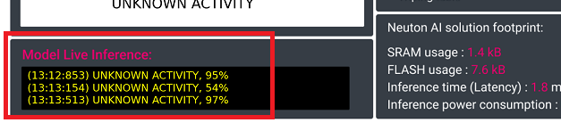

# Neuton.AI xG24 Human Activity Recognition Demo

- [Overview](#overview)
- [Model specifications](#model-spec)
- [Hardware overview](#hw-overview)
- [Setup software environment](#setup-sw-env)
- [Setup firmware project](#setup-fw-proj)
- [Python demo setup](#setup-py-demo)
- [How the project works](#how-works)


## Overview <div id='overview'/>

This project demonstrates a Neuton.AI model for Human Activity Recognition using [__Silabs xG24 Dev Kit__](https://www.silabs.com/development-tools/wireless/efr32xg24-dev-kit?tab=overview). The xG24 development kit could be connected to the PC via Bluetooth and using custom BLE characteristic send regonized activities to the PC where they will be rendered using a python script. Based on accelerometer and gyroscope data the Neuton.AI model could recognize __8 classes__ of activities: Hand washing; Brushing Hair; Wiping a table; Hand Waving; Using screwdriver; Clapping; No movements; Unknown activity.

## Device orientation

Place the device on left hand with usb-slot & cable facing outwards from hand as shown in the example below. Make sure to adjust the strap tightly to eliminate unnecessary device movement.


`#TODO Show device orientation on hand and describe how to perform movements`

|                                       |                                        |                                               |
| ------------------------------------- | -------------------------------------- | --------------------------------------------- |
|  |  |  |
| Hand washing                          |  Brushing Hair                         |    Wiping a table                        |
||   |  |
| Hand Waving                           | Using screwdriver                      |      Clapping               |


## Model specifications <div id='model-spec'/>

The Neuton.AI Human Activity Recognition solution memory footprint:

__Version 1.1.2__
|                       |    FLASH       |   SRAM      |
| --------------------- | -------------- | ----------- |
| __Total Footprint__   | __7.6 kB__     | __1.4 kB__  |
| Signal Processing     | 2.1 kB         | 1.1 kB    |
| Inference Engine      | 0.7 kB         | 0.35 kB    |
| Model                 | 5.8 kB         | 0 kB        |

Model Perfomance:
+ 8 classes.
+ 168 neurons.
+ Holdout Balanced Accuracy: __98.6 %__.
+ Overall Inference time ( __including__ Signal processing ): __1.8 ms__.

*Estimated on Cortex-M33, 39MHz, compiled with -Os ARM GNU toolchain.*

## Hardware overview <div id='hw-overview'/>


The xG24 Dev Kit is a compact, feature-packed development platform. The development platform supports up to +10dBm output power and includes support for the 20-bit ADC as well as other key features such as the xG24’s AI/ML hardware accelerator. You can find more information on the Silicon Labs xG24 Dev Kit at https://www.silabs.com/development-tools/wireless/efr32xg24-dev-kit

## Setup software environment <div id='setup-sw-env'/>

To set this project up, you will need to install the following software:
1. [Simplicity Studio 5](https://www.silabs.com/developers/simplicity-studio)
2. [Gecko SDK v4.2.2](https://github.com/SiliconLabs/gecko_sdk)

## Setup firmware project <div id='setup-fw-proj'/>

1. Clone this repository: https://github.com/Neuton-tinyML/neuton-silabs-xg24-ble-har
2. In the Simplicity Studio, choose `File -> Import`


3. Browse to the directory `./neuton-silabs-xg24-ble-har` in the cloned repository and select `neuton-silabs-xg24-ble-har` project, and click `Next`


4. On the next page the Build configuration should be automatically detected, just click `Next`.


5. Finish importing at the next page, click `Finish`.


6. Build the project in the Simplicity Studio, right-click on project folder in `Project Explorer` and choose `Build Project` option.


7. Connect xG24 Dev Kit to the PC via Micro-USB cable.

8. Wait for the end of the compilation process and flash the device, right-click on project folder in `Project Explorer` and choose `Debug As -> Silicon Labs ARM Program`.


9. Explore the project and Neuton.AI model capabilities!

# Python demo setup <div id='setup-py-demo'/>

To install and run the [UI demo](demo/README.md) you should have installed:

+ Python 3 and add python3 to your system PATH
+ Pip3 (Python should install it automatically, you can check it with `pip3 --version`)

After installing python3 you can execute `install_demo_win.bat` or run `pip3 install -r requirements.txt`, this script will install
all necessary python dependencies for demo application.

After successful installation of all dependencies you can run `run_demo_win.bat` to
start a demo application.


# How the project works <div id='how-works'/>

The project has device logs and you can open the Serial Port to see them. The Serial Port(USART) has the following configuration:

```
Baudrate:       115200
Data:           8-bit
Parity:         none
Stop bits:      1-bit
Flow control:   none
```
Once the device is up and running, Bluetooth advertising starts and waits for connection request from the PC. In the device logs you should see similar messages:

```
[I] Bluetooth stack booted: v5.1.0-b144

[I] Bluetooth public device address: E0:79:8D:C6:A2:B9

[I] Started advertising
```

After running the [demo](demo/uiapp_ble.py) you should see the following UI:


When device is **connected** it will send live model inference results to the PC via bluetooth:



The “Activity image” will change in the view depending on the model predictions:


In the serial port terminal you can also see model live predictions:


Enjoy exploring the project!